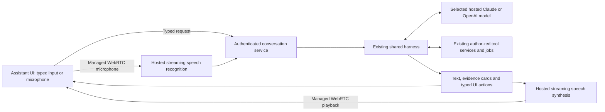

<!-- SPDX-FileCopyrightText: Contributors to PyPSA-Eur <https://github.com/pypsa/pypsa-eur> -->
<!-- SPDX-License-Identifier: CC-BY-4.0 -->

# Decision: hosted streaming speech over the shared assistant harness

Status: independently reviewed and approved for phased implementation.
Implementation and performance gates pending.
Review: [findings, adjustments and final verdict](2026-10-10-assistant-plan-review.md).
Date: 2026-10-10.
Basis: [voice product research](2026-10-10-voice-options-and-tool-workflows.md)
and the user's priority of accuracy, responsiveness, correctness, speed and ease
of use. This selects a first implementation and supersedes the earlier suggestion
to choose between two simultaneous prototypes before starting product work.

## Decision

Use a **hosted chained speech pipeline**, managed WebRTC through **LiveKit Cloud**,
and a custom bridge to the **existing shared harness**. All speech and reasoning
inference stays on external services. No local LLM/GPU is required. LiveKit is
the media/turn/playback layer; it is not a replacement project/tool agent.

Initial speech components: a Deepgram multilingual streaming recognition profile
and OpenAI hosted speech synthesis using the existing credential configuration.
Validate language/device coverage and streaming latency before fixing exact
speech model IDs in production. Use the existing validated cloud reasoning
profile; prefer a Sonnet-class Claude profile for the initial tool assistant when
configured, and preserve the existing OpenAI profile path. Do not migrate model
IDs silently. Vendor adapters remain independently replaceable.

One selected reasoning model receives finalized speech or typed messages through
the harness. Its evidence-grounded answer streams to the UI and speech synthesis.
Do not add a second conversational model that rewrites tool outcomes. This reduces
the number of planners and the opportunities to change numbers, units, project
references or action status. It is an architectural reliability rationale, not
a measured claim that a particular model/provider never fails.

The audio worker can be deployed on managed cloud infrastructure. Its bridge
authenticates to the existing application backend with a short-lived, owner- and
session-bound credential. If separated across services, it receives no general
project credential or raw tool handler access. Backend connection state, routing
and media processing do not imply loading a local reasoning model.

## Why this path

- The harness already normalizes Claude/OpenAI tools, approvals, sessions,
  budgets, workflow progress and provider switching. Reusing it avoids a second
  tool planner and a second history/authorization policy.
- Streaming recognition, sentence-level speech generation and cancellable audio
  give continuous listening and barge-in. This is interruptible conversation,
  not a claim of native full duplex semantic dialogue. The pipeline needs its
  own turn/correction policy and remains subject to STT → model/tools → TTS latency.
- Managed WebRTC and media lifecycle support reduce the browser/network machinery
  we would otherwise operate. The custom harness bridge is still application work.
- The displayed answer and spoken wording can share one authoritative text stream.
  Speech pronunciation of technical numbers/units still needs validation.
- GPT-Live remains an optional later speech frontend if native overlap materially
  improves measured UX. Its documented harness delegation is credible, but another
  model paraphrases results and its delegation event lacks task text. Do not make
  that extra context layer necessary for the first engineering assistant.

An 8B local model may work for constrained tasks. We have no evidence that one
meets all of this application's engineering workflows, tool schemas, multilingual
speech and follow-up correctness requirements. An 8B LLM also does not supply
speech recognition, synthesis or media transport by itself. Therefore choose
external inference now; local serving is outside this implementation's scope.

## Extracted product requirements

Scope is the whole application. Load flow is an example, not a feature boundary.
The mandatory [application coverage contract](../../../.scratch/live-voice/application-coverage.md)
and generated [source inventory](../../../.scratch/live-voice/capability-inventory.json)
cover tool, UI, parameter, result, experiment, monitoring and prolonged-conversation
requirements. The snapshot has 220 tools, 14 result tabs and 17 SlidePanel IDs;
GUI/schema mapping and real behavior still need implementation gates. Existing
navigation omits adequacy/FMEA IDs from the tool enum; record and close such gaps.

| Requirement | Concrete behavior |
| --- | --- |
| Personal assistant UI | Persistent assistant dock, ongoing conversation, project/run context, compact progress and result cards; expand when needed |
| Natural requests | “Open project X”, “summarize current load flow”, “show critical lines”, “try a sensitivity”, “export this” invoke real harness operations |
| Full tool reachability | All existing authorized/project-eligible catalogue tools remain reachable; offer relevant toolsets on demand rather than a separate reduced voice catalogue |
| Project awareness | Server-authoritative project binding plus current result source, section, period/window and selected asset identifiers; revalidate ACL at use |
| Detailed follow-ups | Retain discussed run, baseline, section and asset references; retrieve fresh tool evidence for the question, not guesses from past prose |
| Guided navigation | Open the actual project/results view, select the requested section/asset and show the same evidence the assistant discusses |
| Responsiveness | Immediate visible acknowledgement, streamed answer/audio, cached bounded evidence, no full-network prompt or repeated model job polls |
| Correctness | Software-computed metrics, explicit units/source/solver validity; stale or missing evidence is visible and never reported as zero |
| Natural interruption | Stop playback promptly; distinguish speech interruption from task/job cancellation and preserve already completed effects |
| Reliability | Bounded queues, single turn lease, idempotency/generations, authenticated recovery, visible typed fallback and no replayed writes |
| Easy setup | One Start conversation control, language/microphone setting when needed, clear mute/end controls and a compact readiness page |
| Import/export and studies | Use existing file/report/scenario/GridSpine tools through the same ownership and confirmation rules |
| Whole application | Include all result tabs and settings/editors, Library/investment/participants, time series/multi-period inputs, adequacy/FMEA/health/frontier/Monte Carlo, reports, audit/undo and workflows; inventory exposes missing interfaces |
| Cross-domain experimentation | Typed parameter variants, isolated baselines, domain-specific execution, stop conditions, partial outcomes, provenance and compatible comparisons |
| Monitoring and refreshed results | Independent job subscriptions with replay cursor/snapshot, evidence revision invalidation and acknowledged UI updates; user can converse while work runs |
| Prolonged conversation | Durable thread goals/references/checkpoints and cumulative budgets survive audio lifecycle, guarded model/session rotation and validated project changes |

Conversation is the main interaction surface. Existing confirmation/choice cards
stay inline at the steps that actually need them; do not turn ordinary reads or
navigation into a wizard. Opening an existing named project and creating a new
project are different requests; ask only when the user's meaning is ambiguous.

## Example: current load flow and critical lines

1. Resolve the active authorized project and the discussed/current run. Check
   completion, freshness and result source (`lopf` versus `ac_pf`). The project
   name/context can be known without an extra LLM discovery turn.
2. Read a bounded backend load-flow summary: validity/convergence, covered
   snapshots, critical line/transformer rankings, loss/voltage availability,
   configured limits, units and missing-data warnings. Reuse the same aggregation
   service for run evidence and the UI.
3. Explain the highest-priority findings, then issue
   `ui_open_panel(panel_id='results', results_tab='loadflow')`. This is the existing
   actual Results tab. It contains a line table and charts. For one line, use
   `ui_open_asset_detail(component_class='Line', name=...)`; extend typed navigation
   to highlight/scroll/source/window selection where necessary. Do not confuse the
   bottom Lines component-editing table with line-result evidence.
4. “Why is that line critical?” reads the same line/run's parameters and detailed
   evidence. “Try increasing capacity” prepares explicit scenario changes through
   `run_sensitivity_sweep`, keeps the baseline, obtains the existing execution
   confirmation, runs jobs, waits locally and compares verified outcomes.

Current UI loading statistics use peak absolute active flow divided by nominal
capacity. The new summary must label that convention and must not silently call
it a full AC thermal assessment. For AC apparent-power loading, use supported
P/Q evidence and terminal-specific configured limits; for LP/DC results, state
the model convention. Handle optimized ratings, `s_max_pu`/time-varying limits,
incomplete snapshots, weighting and missing ratings explicitly. Never infer that
uncomputed voltages/reactive power/convergence passed.

Expose this as a shared read-tier `get_loadflow_summary` tool (or the equivalent
bounded section of `get_run_evidence`) backed by one aggregation implementation.
Its initial use can work with current results; historical support depends on
immutable run artifacts. Avoid duplicate UI/voice definitions of criticality.

## Speed and reliability design

- Stream transcript previews; submit a stable utterance once. Use turn detection
  with an adjustable pause policy and avoid acting on unfinished “7.5, not 75”.
  Keep the microphone available while replies play. Uncertainty prompts one
  focused clarification rather than guessed tool arguments.
- Stream speakable sentences from the same assistant text. Buffer sentences only
  as much as needed for numbers/units and coherent phrasing; suppress code, long
  tables and tool logs. No per-result model rewrite just for speech.
- Add an interactive reasoning/output preset for simple reads/navigation, while
  preserving deeper reasoning for engineering studies. Load relevant tools on
  demand; all eligible tools remain reachable via existing toolsets.
- Cache project identifiers, unchanged context and evidence by run/input
  fingerprint; invalidation follows edits/run changes, not an arbitrary TTL alone.
  Prewarm connections only within an explicit active session/cost policy.
- Admit at most one harness turn. Track one bounded pending follow-up/correction,
  reject obsolete callbacks, and use tool progress/job events instead of model
  polling. A tool's success, confirmation and cancellation are distinct states.
- Speech-service failure falls back visibly to typed chat with the same harness
  session. Model fallback follows existing policy and never repeats uncertain
  side effects. A lost tool response needs reconciliation before retry.
- Track actual audio playback separately from generated text. The harness records
  authoritative task history; keep a heard-position marker and provide a concise
  recap after interrupted speech without deleting executed action facts.

Long-running `run_simulation`/`run_ac_pf_stage` currently retain the sole harness
turn in their solver-log bridge. A pending queue does not fix that responsiveness
gap: add a nonblocking job/task handoff with stable IDs, release the turn lease
and subscribe to progress independently. Apply domain-specific adapters to every
async study worker; the solve queue alone is not sufficient. A second read can
complete while a job runs; project locks continue to block conflicting writes.

Persist a durable conversation outside process-local harness sessions. Initial
deployment has one authoritative application worker with pinned media gateway/
stream/confirm/abort/history routing. A restart reconciles uncertain effects,
invalidates approvals and rehydrates a new transient episode; history replay
does not recreate ownership/locks. Parent budgets survive restart/episode rotation.
Model switching obeys existing history-portability restrictions. Project rebinding
refreshes owner-scoped bridge credentials and rejects old callbacks while the
durable conversation continues. Multiworker deployment requires distributed leases
and explicit failure tests later. Agent worker hosting/resources must be provisioned
and measured; LiveKit Cloud media does not deploy that worker automatically.

Initial measurement targets, not current guarantees: visible feedback ≤300 ms;
playback stop p95 ≤250 ms; first useful grounded spoken answer p95 ≤2 s for a
simple cached read and ≤3 s for the reference uncached small case. Measure on
reference broadband/hardware and by language. Long solves report immediate
progress and actual job completion; never pretend the solver meets a chat target.
Measure from the recorded end of speech including turn detection, STT finalization,
model/tool round trips and TTS/playback. An acknowledgment is a separate metric
and never counts as the first grounded answer. Sample every capability family,
long conversations and concurrent monitoring; publish distributions, not a single
successful timing. Treat latency as a tested objective, not a guarantee of provider
availability or superiority over unbenchmarked alternatives.
If targets fail, first reduce needless calls/payloads and tune the hosted speech
components. Compare GPT-Live only if the chained architecture's measured turn
experience remains inadequate after those improvements.

## Delivery gates

1. Generated whole-application capability/GUI/parameter matrix, complete tool
   discovery/reachability within provider limits and actual navigation work from
   typed chat first; preserve current tool/ACL contracts and close mapped gaps.
2. Assistant dock redesign and reference-aware follow-ups work independently of voice.
3. Hosted media/STT/TTS bridge streams the ordinary harness and releases devices on
   every exit; validate exact numbers/units and required languages.
4. Durable thread state, pinned single-worker routing, nonblocking cross-domain
   experiment/job progress, reconnect, provider errors, budgets and stale
   event suppression pass. Voice/token usage is counted with provider-specific
   billing units; LiveKit/STT/TTS/LLM expenses are separate. No fixed whole-task
   cost is asserted before selecting plans and measuring usage.
5. At least one real small journey per application family, all results/parameter/
   navigation contracts and prolonged mixed-domain conversations pass state/content
   assertions plus latency/accuracy/device release gates. Load flow is one example.

New prerequisites: LiveKit Cloud credentials and the selected hosted streaming
STT credentials, alongside an available reasoning profile and speech-output key.
These are deployment prerequisites, not evidence that the feature is currently
configured. No live media benchmark was run for this decision. Baseline evidence
remains in the linked research report. Updated implementation details:
[plan](../plans/2026-10-10-live-voice-conversation.md) and
[spec](../../../.scratch/live-voice/spec.md).
