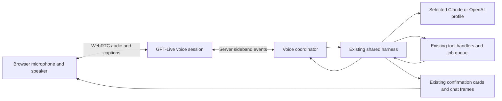

<!-- SPDX-FileCopyrightText: Contributors to PyPSA-Eur <https://github.com/pypsa/pypsa-eur> -->
<!-- SPDX-License-Identifier: CC-BY-4.0 -->

# Live voice conversation feasibility

Assessed 2026-10-10 against `feat/multilingual-dictation`, commit
`5e6ac4e3abd6539022219616d98e2f2c8ff881b1`. Dictation is in draft PR
[#106](https://github.com/MLHaoChang/pypsa-eur/pull/106); it is not evidence of a
released live-voice feature. This document is an assessment, not an implementation.

Later requirements produced an adopted first-implementation decision:
[hosted streaming speech over the shared assistant harness](2026-10-10-hosted-assistant-architecture-decision.md).
The original native-speech recommendation below remains feasibility evidence;
GPT-Live is now an optional later adapter rather than the initial dependency.

## Recommendation

Feasible. The first native-speech pilot should use an explicitly started
**Live conversation** mode using GPT-Live over WebRTC, with **client delegation
to the existing harness**. Compare it with a Claude-based chained voice pilot
before choosing a default; see the subsequent
[product and tool-workflow research](2026-10-10-voice-options-and-tool-workflows.md).
Keep typed chat
and reviewed dictation available. The speech frontend can listen while speaking;
the shared harness remains responsible for planning, tools, confirmations,
project access, job state, history and budgets. Claude and OpenAI backend profiles
continue to use the same tools. Voice transport and backend model selection are
independent: GPT-Live speech requires OpenAI credentials even with a Claude backend.

This is preferable to making a second agent execute the tool catalogue directly.
It also avoids replacing the harness with OpenAI-managed Responses delegation.
Full duplex speech does not require concurrent mutating project turns.

## What exists and what is missing

| Existing component | Present behavior | Needed for conversation |
| --- | --- | --- |
| ChatPanel and SSE harness | Streams text, tool progress, choices and confirmations | Show voice captions independently of authoritative tool/task status |
| DictationControls / useAudioDictation | Records a bounded segment, transcribes, reviews, inserts | Separate live connection and microphone lifecycle; retain current dictation UX |
| Browser speech recognition | Disabled while chat streams | Input must remain available during speech and tool work |
| speechOut | Browser speech synthesis after `turn_done`, whole reply with length cap | Low-latency generated audio, interruption and independent playback state |
| Harness provider seam | Text/tool events, shared handlers | Reuse it behind a voice coordinator; no audio SDK in shared tool code |
| Turn lock / abort | One harness turn in flight; cooperative abort | Bounded follow-up queue, task corrections and distinct speech/task cancellation |
| Job queue and evidence tools | Long-running solves and bounded result extraction | Save job/task state while voice closes, resume with verified results |

The main work is orchestration and lifecycle management, rather than new
engineering tools. Dictation's current stream-start cancellation should remain
for dictation; live mode must not share that cancellation trigger.

## Current API evidence

Official documentation was checked on the assessment date:

- [GPT-Live](https://developers.openai.com/api/docs/guides/live): full duplex
  speech and an independently selected backend.
- [Client delegation](https://developers.openai.com/api/docs/guides/live-delegation):
  `delegation: {type: "client"}` connects any application agent/harness.
- [WebRTC](https://developers.openai.com/api/docs/guides/voice-webrtc?api=live):
  server exchanges an SDP offer through `POST /v1/live/sessions`; browser audio
  uses media tracks. Session config and long-lived API key stay on the server.
- [Server controls](https://developers.openai.com/api/docs/guides/voice-server-controls?api=live):
  trusted server attaches to `wss://api.openai.com/v1/live/sessions/{session_id}/attach`.
- [Session lifecycle](https://developers.openai.com/api/docs/guides/live-conversations):
  independent input/output transcript deltas, cumulative duration usage, graceful close.
- [Pricing](https://developers.openai.com/api/docs/pricing) and
  [cost accounting](https://developers.openai.com/api/docs/guides/voice-latency-cost?api=live).

An authenticated, non-inference `/v1/models` check returned HTTP 200 and listed
`gpt-live-1`, `gpt-live-transcribe`, `gpt-realtime-2.1`,
`gpt-realtime-2.1-mini`, `gpt-4o-mini-transcribe` and `gpt-4o-mini-tts`.
Model visibility is not proof that session creation, sideband attachment, browser
media transport or acceptable multilingual quality work for this account.
No paid audio session was created for this assessment.

Client delegation has an important contract: `session.delegation.created`
contains a delegation ID and timeline offset, **not the user's task text**.
The server must collect `session.input_transcript.delta` and
`session.output_transcript.delta`, preserve spacing and timing, and build context
from those events plus application state. Fragments are not finalized user turns.
The adapter must resolve ambiguous or incomplete instructions before executing
dependent actions. Return bounded verified facts through
`session.thinking.append` (quiet context) or `session.commentary.append` (spoken
update). Each append is limited to 500 tokens. An append acknowledgment does not
mean the user heard the message or that a tool finished.

## Alternatives and cost

| Option | Benefit / limitation | Verified price |
| --- | --- | --- |
| Current recorded dictation | Lowest audio cost; review step and transcription delay | `gpt-4o-mini-transcribe`: estimated $0.003/audio minute |
| Chained streaming transcription → harness → speech | Backend remains independent; application implements turn detection, interruption and speech output | `gpt-live-transcribe`: $0.017/minute of billable streamed audio, plus model and speech output |
| GPT-Live + client delegation (recommended) | Full duplex voice plus existing harness; active idle time is charged | `gpt-live-1`: $0.05/active session minute, plus backend usage |
| Native Realtime agent | Low-latency speech with function calls; more work to preserve current text-provider/history contracts | `gpt-realtime-2.1-mini`: audio $10/M input, $0.30/M cached input, $20/M output tokens; text charged separately |

GPT-Live voice alone costs **$0.50 for ten active minutes or $3.00/hour**.
Silence, muted microphones and backend waiting time are included. WebRTC session
creation bills 15 seconds ($0.0125) during initialization, credited against the
running session's duration; do not add it twice. Failed/repeated startup attempts
must be included in accounting. Streaming transcription's ten-minute audio charge
is $0.17; that excludes backend and speech synthesis. Do not compare that partial
charge with a complete GPT-Live conversation total.

Close idle sessions and offer Resume conversation. During long simulations,
close voice after informing the user and persist the job independently. Reopen
only through the chosen user-facing resume policy. Keep stable system/tool
prefixes for backend prompt caching; send only changed, bounded UI/project state.
Reuse existing evidence caches with their freshness checks. Do not send complete
network tables or rewrite every tool result through another model.

For the chained alternative, the current `gpt-live-transcribe` documentation
requires client-side VAD and manual commits; server/semantic VAD is unsupported
for that model. Do not copy a native Realtime VAD configuration into it. Native
Realtime pricing is token-based and conversation context is replayed/cached;
there is no single reliable flat per-minute estimate for a whole task.

## Implementation boundaries and remaining risks

- Speech interruption stops playback; task interruption is a separate decision.
  Already executed writes remain executed. Chat abort does not prove queued-job
  cancellation. Check job state and cancellation acknowledgment before saying
  a simulation stopped.
- Run at most one harness turn per session. Queue a bounded follow-up and attach
  corrections to the current task generation. Late output from an obsolete task
  cannot trigger another write or announce obsolete success.
- Keep confirmation cards and their exact scoped tokens/TTL. Initial release
  requires the existing explicit approval interaction. Ambient “yes” does not
  authorize project changes. Voice requests for actions still use normal gates.
- Keep backend task records, spoken captions and actual playback separate. Never
  assume a backend reply or transcript delta was heard in full. GPT-Live can
  paraphrase; verify numbers, units and completion claims against tool evidence.
- User/project/organization ownership applies to creation, sideband and controls.
  A user-initiated project/profile change closes voice. An authorized tool's
  `project_rebound` requires a validated coordinated rebind for create-project
  workflows; do not accidentally kill their conversation.
- Validate browser autoplay/permission/device behavior, echo cancellation, noisy
  speakers and supported languages on real hardware. WebRTC traffic from the
  user's browser is not proven by successful HTTP proxy access from this workspace.
- Disconnect, stale permission grants, tab hiding and explicit End must release
  local media and close the provider session. Keep a server watchdog if the browser
  disappears; bounded graceful-close timeouts record final usage as unconfirmed.
- Give Start/End, mute, captions, language preference, tool-status cards, and typed
  fallback. Show a clear active microphone indicator and AI voice label. Store
  application transcript/task state under existing access rules; leave provider
  recording storage off initially.

## Verification in this assessment

- Frontend: **51 passed** across five files: speechOut, ChatPanel speech,
  audioRecorder, DictationControls and dictation API tests.
- Backend: **25 passed, one skipped** across disconnect/abort, session ownership,
  confirmation seam and turn-frame contract tests. The skip is deliberate golden
  frame recording, which must not run in ordinary tests. Existing FastAPI lifespan
  deprecation warnings remain.
- Live voice, interruption timing, endpoint entitlement, WebRTC traversal, long
  session cost and real-device accuracy remain **unverified**. Baseline tests do
  not establish those new behaviors.

Implementation sequence, acceptance gates and handoff issues:
[plan](../plans/2026-10-10-live-voice-conversation.md) and
[spec](../../../.scratch/live-voice/spec.md).
