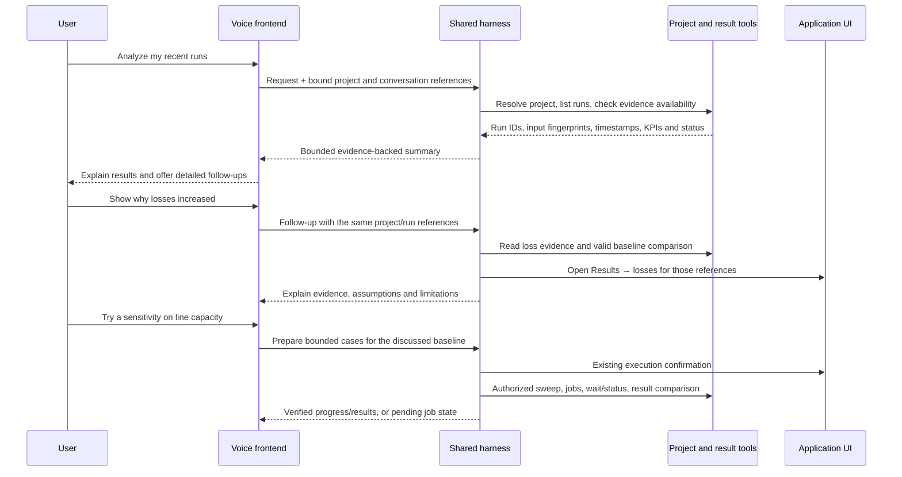

<!-- SPDX-FileCopyrightText: Contributors to PyPSA-Eur <https://github.com/pypsa/pypsa-eur> -->
<!-- SPDX-License-Identifier: CC-BY-4.0 -->

# Two-way voice options and project-aware tool conversations

Research date: 2026-10-10. This supplements the
[initial feasibility assessment](2026-10-10-live-voice-conversation.md).
Primary documentation and upstream repositories were retrieved and inspected;
no paid model calls or vendor media benchmarks were performed in this research.
Availability and integration effort below distinguish documented capabilities
from unverified performance in this application.

## Recommendation

Build one provider-neutral conversation coordinator over the existing harness.
Pilot **GPT-Live client delegation** and **a chained Claude/harness voice pipeline
using Pipecat or LiveKit** against the same project/result/sensitivity fixtures.
Choose the default from measured numerical fidelity, successful tool outcomes,
useful-answer latency, interruption behavior and cost per successful task.
GPT-Live is the strongest first native-speech candidate because its client
delegation explicitly accepts an existing harness; the chained stack is the
strongest portability candidate. Gemini Live is a credible second native option.
Use one orchestration framework for a chained prototype, not both simultaneously.

Open-source orchestration is different from open-source models: Pipecat/LiveKit
can use commercial APIs, while an entirely local deployment also needs local
speech recognition, reasoning/tool calling and speech generation.

## Product comparison

| Option | Voice and tool capability | Pros for this application | Cons / integration work |
| --- | --- | --- | --- |
| **OpenAI GPT-Live** (`gpt-live-1`) [1] | Documented full duplex speech; client delegation connects any backend harness | Conversation continues while our tools work; WebRTC and trusted sideband; backend can remain Claude or OpenAI | Voice is OpenAI-hosted; another model paraphrases backend facts; active silence/tool waits are charged; server constructs task text from timed transcript fragments |
| **OpenAI Realtime** (`gpt-realtime-2.1`, mini) [2] | Native audio, barge-in and function calling | Integrated audio and browser transport; tool arguments/results are supported | Making it the tool planner requires new audio/history adapter work; a delegation facade is simpler for retaining our harness; context/audio token costs vary; must validate long-task behavior |
| **Claude + streaming STT/TTS through Pipecat or LiveKit** [3][4] | Continuous listening and interruptible speech built by the pipeline; Claude already supports tools | Keeps existing reasoning/tool behavior; switch speech vendors independently; spoken technical answer can follow the harness's exact text | Multiple services and extra latency stages; application/framework owns end-of-turn and playback cancellation; less natural overlap than a native full duplex model unless carefully engineered |
| **Google Gemini Live** (`gemini-3.8-live`) [5] | Native continuous audio, interruption, input/output transcripts and function calling; documented non-blocking functions on supported models | Strong native alternative; documented multilingual support; can deliver a result when a background tool finishes | Requires a new provider/session bridge; raw browser integration uses WebSockets/PCM; connection resumption/context compression needed for long sessions; async support is model-specific |
| **ElevenLabs ElevenAgents** [6] | Managed voice agent, Claude/OpenAI/custom LLM support, authenticated webhook tools | Broad speech/voice choices and managed conversation features; custom streaming LLM can wrap the existing harness | Platform billing/configuration; custom endpoint must implement their compatible streaming contract; webhook secrets alone are not per-user project authorization; provider-managed tools must not bypass our gate |
| **Deepgram Voice Agent** [7] | Managed STT/LLM/TTS, Claude/BYO LLM, function requests/responses and cancellation events | Speech pipeline and turn detection integrated; explicit tool-call lifecycle; independent component selection | Another stateful agent protocol; default speculative function dispatch is unsuitable for writes: defer them until end of turn and retain our confirmation gate; cancellation cannot undo completed effects |
| **Amazon Nova 2 Sonic** [8] | Native bidirectional speech, interruption and asynchronous function/tool handling | Credible option for an AWS deployment; background tools with continuing conversation | Adds Bedrock/IAM/region and audio relay work; reviewed voice list has English, French, Italian, German, Spanish, Portuguese and Hindi, so Mandarin coverage cannot be assumed; harness bridge still required |
| **Fully local modular stack** [9] | Pipecat/LiveKit + streaming sherpa-onnx or chunked faster-whisper + Qwen3-8B through vLLM + Kokoro TTS | Self-hosting, component control, no hosted speech inference charge; same harness/tools available to other agents | CPU/GPU capacity, model serving and operations; languages/licenses differ by checkpoint; chunked Whisper is not native streaming; tool parser and engineering terms/numbers need evaluation; no flat “free” operating cost |
| **Moshi / NVIDIA PersonaPlex** [10] | Open-weight native full duplex speech models | Local native overlap/backchannels; useful conversational research candidates | Reviewed reference implementations do not establish production structured-tool execution; require a transcript/delegation bridge and separate reasoning harness; GPU/serving work; Moshi model weights CC-BY-4.0, PersonaPlex weights NVIDIA Open Model license |

For native products with function calling, expose an authenticated
**delegation facade to the existing assistant**, or implement a fully gated
provider adapter. Do not register a parallel unrestricted set of raw project
handlers. The user still asks for actions directly by voice; the shared harness
performs the actual tool operations and returns evidence to the speech model.

For Pipecat/LiveKit, use a custom model/service adapter that runs our harness.
Using their default Claude agent plus a copied tool catalogue would create a
second planner and risk diverging confirmation/history/budget behavior.

## Anthropic availability

Anthropic's public model overview currently says all current models accept text
and images and produce text. It documents tool use. Its consumer Claude app has
voice mode and connected-tool support, but that is **not documentation of an
embeddable Anthropic speech-to-speech API**. Therefore the practical Anthropic
option here is a Claude backend with a separate STT/TTS layer, or Claude behind
GPT-Live client delegation. This is a statement about the reviewed public API
documentation, not a claim that Anthropic has no internal speech technology.

The current overview lists IDs including `claude-sonnet-5-5` and
`claude-haiku-5-5`; middleware examples may still use older IDs. Do not silently
migrate our existing profiles based on sample code. Check provider model access,
pricing and our harness regression fixtures before changing an actual profile.

## Cost comparison

Prices checked from primary pages on the research date. These are different
billing units, not an equal-workload performance benchmark.

| Option | Published billing basis | What to include in a real task estimate |
| --- | --- | --- |
| GPT-Live | $0.05/active session minute, billed per second | $0.50 for ten active minutes, plus backend tokens/tools. Silence, mute and tool waits count. WebRTC initialization bills 15 seconds credited against running duration, not an extra repeated charge |
| OpenAI Realtime 2.1 mini | Audio $10/M input, $0.30/M cached input, $20/M output tokens; text $0.60/M input, $0.06/M cached, $2.40/M output | Conversation history, cached context, modalities and any separate transcription; no flat price for a ten-minute task |
| Gemini 3.8 Live | Audio $3/M input and $12/M output; vendor estimates $0.005/input audio minute and $0.018/output audio minute. Text $0.75/M input and $4.50/M output | Actual input/output duration and context usage, plus delegated backend calls if we keep the harness. Ten input minutes plus ten output minutes estimates $0.23 of audio alone; that is not a ten-minute complete-task quote |
| Claude chained stack | STT audio + Claude input/cache/output tokens + TTS + transport/hosting | Compare the selected speech services and generated speech duration; existing recorded OpenAI dictation at $0.003/audio minute is not a full live conversation price |
| ElevenAgents / Deepgram | Platform plan or connection-minute pricing plus applicable BYO components | Check current plan, included model tier, concurrency and external LLM/TTS charges; do not assume every advertised per-minute tier includes the chosen Claude model |
| Local stacks | Provisioned CPU/GPU, memory, bandwidth and operations | Utilization/concurrency, idle capacity, model loading and engineering effort; local weights do not make production inference cost zero |

Gemini's documentation includes free-tier data-use distinctions and paid-tier
pricing; select the deployment tier deliberately. Pipecat currently has a BSD
2-Clause license; LiveKit Agents has Apache-2.0 code and a separate turn-model
license. sherpa-onnx has Apache-2.0 code and model-specific weights; Kokoro-82M
and Qwen3-8B weights are Apache-2.0. Qwen's model card documents tool use and
vLLM-compatible serving; configure and test the appropriate function-call parser
and reasoning/text separation instead of adding Qwen-Agent as another planner.
This is an available component stack, not a verified end-to-end deployment here.
Model/language choice remains an implementation gate.

Reuse stable prompts/tool schemas, bounded evidence caches and unchanged UI
context. Keep prices configurable and recheck them before any paid comparison.
Close duration-priced voice during long unattended solves while jobs continue.
Do not continually send full network tables or perform model polling for jobs.

## Required project-aware conversation

The example expresses desired behavior. Historical-run helpers below are
proposed additions, not available live-voice functions today.

1. Resolve the authenticated active project from the application/session binding.
   Announce its human-readable name once. Use current panel, selected asset,
   result section and snapshot as references, not as a second source of numerical
   truth. With no project, use the picker/list; with ambiguous projects, clarify.
2. Interpret “recent” as a bounded latest-run listing in that project. Default
   analysis to the latest completed run with available evidence, while disclosing
   a newer failed/running run. A failed or incomplete solve is never summarized
   as a successful zero-result case. Historical runs can remain valid evidence
   for their saved inputs even when they are no longer current project results.
3. Keep `discussed_project_id`, `discussed_run_id`, baseline/case IDs, evidence
   fingerprint, result section and last question in conversation state. “That
   peak”, “the previous run” and “open its dispatch tab” resolve against those
   references. A manual project switch needs an explicit rebind policy and stale
   result rejection; an ordinary results-tab change must not reset conversation.
4. Start with software-computed headline metrics and freshness/solver status;
   fetch only the requested detailed section afterward. Speak concise findings
   with units; keep charts/tables and provenance visible. Separate optimization
   output, AC power flow and GridSpine steady-state evidence. Do not infer dynamic
   compliance or an unsupported causal conclusion from them.
5. Open application panels/tabs through typed UI events, acknowledge the selected
   project/run/section, then continue speaking. The current UI supports application
   panels/results tabs/compare rails, not an arbitrary new-browser-tab operation.
   If new workspace tabs are required, add managed tabs carrying explicit
   project/run references; do not send arbitrary URLs to `window.open`.
6. A sensitivity request prepares validated cases for the discussed baseline,
   obtains the normal execution approval, enqueues solves and compares completed
   evidence. The baseline stays unchanged. A spoken “stop talking” stops playback;
   it does not silently undo cases or cancel jobs.

## Existing tool coverage and concrete gaps

| User intent | Existing tools / behavior | Addition needed |
| --- | --- | --- |
| “Which project is this?” | Server-bound context, `project_readiness`, `list_projects`, `activate_project` | Voice coordinator consumes/revalidates the same binding |
| “Analyze the latest results” | `get_simulation_status`, `dispatch_status`, `get_project_results_summary`, `get_study_evidence(section='simulation')` | Speech projection plus stable discussed-run references; saved/unsaved evidence policy must be explicit |
| “Compare recent runs of this project” | `solve_queue_list` includes live and persisted job history with ACL/redaction; objectives/timings. `list_scenarios`, `compare_scenarios` compare saved cases | **Immutable per-run inputs/result artifacts and bounded `list_project_runs` / `get_run_evidence` / `compare_project_runs`**. Latest saved network results cannot answer arbitrary older-run section questions |
| “Explain a detailed section” | `get_results`, `get_asset_results`, focused scenario comparison; GridSpine `get_study_evidence` filters/pages | Run-specific bounded aggregates/pages; numerical/source references carried to speech and UI |
| “Open that results tab” | `ui_open_panel`, `ui_open_asset_detail`, `ui_select_component`, `ui_set_snapshot`, `compare_scenarios(open_compare_rail=true)` | UI event delivery during voice plus run-aware view/acknowledgment; managed workspace tabs only if requested as a distinct product feature |
| “Create a sensitivity and compare” | `run_sensitivity_sweep`, `wait_for_job`, evidence, comparisons | Voice lifecycle and references; existing 1–4 cases/typed-input bounds and confirmation remain |
| “Refine the GridSpine study” | Config/pipeline tools, ranked snapshots, connection assessments and bounded evidence | Live explanation and stable study/run/assessment references; archive older study evidence if historical comparison is promised |
| “Export this result” | Existing network/result/report exports | Bind export to the discussed run. If an exporter only supports current state, add run-aware service support or clearly refuse historical export; do not quietly export the newest run |

### Run evidence contract

Introduce the following **provider-neutral** tools over shared services, with the
normal catalogue/dispatcher/route/schema tests; their implementation does not
belong in an audio provider:

- `list_project_runs(project_id?, limit, cursor, status?)`: authorized project only;
  stable run ID, job ID when applicable, created/finished times, solver/mode,
  input/config fingerprint, status, concise KPIs and `evidence_available`.
- `get_run_evidence(project_id, run_id, section, filters?, offset, limit)`:
  immutable run-specific metrics/pages, units, warnings, provenance, completion
  and artifact availability. No arbitrary filesystem path. Return a typed
  unavailable response when old detailed artifacts were never preserved.
- `compare_project_runs(project_id, run_a, run_b, focus)`: compute deltas in code
  for compatible metrics; state input/assumption/unit differences and incomparable
  fields. Keep run identity throughout, rather than activating/restoring a run.

Persist a run manifest and immutable input/result references atomically with each
supported completion path. Capture foreground unsaved inputs as the inputs that
actually ran, not whatever was saved later. Track queued, failed and interrupted
jobs as well as successful runs. Integrate with existing persistent job records,
not a second queue. Use quotas/retention and expose unavailable/expired artifacts;
do not fabricate historical detail from current `network.nc`. Preserve existing
latest-result endpoints and scenario workflows. UI may need a typed
`ui_open_run_result` extension if its current selection cannot represent a run.

## Validation and release gates

Use the same deterministic fixtures for each candidate:

- Analyze the active project's latest run, then drill into economics, dispatch,
  losses, a named asset and a time/snapshot. Verify every spoken number/units
  against tool evidence and ensure navigation points at the discussed run.
- Three runs in one project: completed, newer failed, newest running. Ask “recent
  runs”, “the previous result” and “compare the first two”; test missing historical
  artifacts and mixed solver modes without substitution or fabricated metrics.
- Request a sensitivity, approve through the existing gate, wait for real small
  solves, compare and export. Include the GridSpine ranked-snapshot/connection
  assessment refinement workflow. Assert project state and export content.
- English/German/Mandarin, code switching, “7.5 not 75 MW”, unclear component
  names, self-correction during speech, background speech, interruption while a
  read/write/job/confirmation runs, silence and long tool waits.
- Switching projects/panels, stale/reordered/duplicate callbacks, revoked ACL,
  provider errors, reconnect, exhausted duration/dollar budget, no stale action
  replay. Provider cancellation must not imply rollback of completed actions.

Collect end-of-speech → first useful grounded audio, playback-stop latency,
correct tool outcomes, numerical fidelity, duplicate effects, language failures
and total cost. Conversational filler is not a successful engineering answer.
Limit paid prototypes deliberately and cache fixture context; no exhaustion run.

Current additional non-paid verification: **71 backend tests passed** across
workflow helpers, catalogue/schema parity, endpoint mapping and UI-panel schemas.
These include real small sensitivity solves and GridSpine wait/ranking/evidence/
refinement checks. Existing FastAPI and scientific-library warnings remain.
This proves baseline tool behavior, not a voice provider integration or comparative
model quality. No production voice code was changed by this research.

Subsequent decision based on the user's accuracy/responsiveness priorities:
[hosted chained speech over one shared-harness planner](2026-10-10-hosted-assistant-architecture-decision.md).
This selects the first implementation and retains the alternatives here as
research, rather than requiring two production implementations in parallel.

## Primary sources

1. OpenAI: [GPT-Live](https://developers.openai.com/api/docs/guides/live),
   [client delegation](https://developers.openai.com/api/docs/guides/live-delegation),
   [pricing](https://developers.openai.com/api/docs/pricing),
   [duration accounting](https://developers.openai.com/api/docs/guides/voice-latency-cost?api=live).
2. OpenAI: [Realtime](https://developers.openai.com/api/docs/guides/realtime).
3. Anthropic: [API models and modalities](https://platform.claude.com/docs/en/models/overview),
   [tool use](https://platform.claude.com/docs/en/agents-and-tools/tool-use/overview),
   [consumer voice mode](https://support.claude.com/en/articles/11101966-use-voice-mode).
4. [Pipecat repository](https://github.com/pipecat-ai/pipecat) and
   [license](https://github.com/pipecat-ai/pipecat/blob/main/LICENSE);
   [LiveKit Agents](https://github.com/livekit/agents) and
   [Claude plugin](https://docs.livekit.io/agents/models/llm/anthropic/).
5. Google: [Live API](https://ai.google.dev/gemini-api/docs/live-api),
   [function calls and asynchronous tools](https://ai.google.dev/gemini-api/docs/live-api/tools),
   [session management](https://ai.google.dev/gemini-api/docs/live-api/session-management),
   [pricing](https://ai.google.dev/gemini-api/docs/pricing).
6. ElevenLabs: [LLM providers](https://elevenlabs.io/docs/eleven-agents/customization/llm),
   [custom streaming LLM](https://elevenlabs.io/docs/eleven-agents/customization/llm/custom-llm),
   [webhook tools](https://elevenlabs.io/docs/eleven-agents/customization/tools/webhook-tools).
7. Deepgram: [LLM providers](https://developers.deepgram.com/docs/voice-agent-llm-models),
   [function calling and defer_until_eot](https://developers.deepgram.com/docs/voice-agents-function-calling),
   [function cancellation](https://developers.deepgram.com/docs/voice-agent-function-call-cancelled),
   [pricing](https://deepgram.com/pricing).
8. AWS: [Nova 2 Sonic](https://docs.aws.amazon.com/nova/latest/nova2-userguide/using-conversational-speech.html).
9. [sherpa-onnx](https://github.com/k2-fsa/sherpa-onnx),
   [faster-whisper](https://github.com/SYSTRAN/faster-whisper),
   [Kokoro-82M model card](https://huggingface.co/hexgrad/Kokoro-82M),
   [Qwen3-8B model card](https://huggingface.co/Qwen/Qwen3-8B),
   [vLLM tool calling](https://docs.vllm.ai/en/latest/features/tool_calling/).
10. [Moshi reference implementation](https://github.com/kyutai-labs/moshi) and
    [PersonaPlex implementation/licensing](https://github.com/NVIDIA/personaplex).
